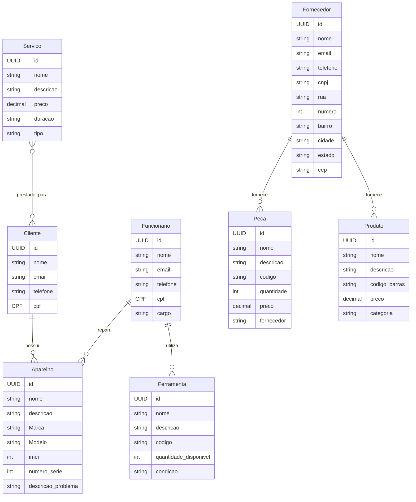

# Contagem de Pontos de Função

A contagem em **Pontos de Função (PF)** permite a determinação do **Tamanho Funcional** do projeto de software.
A análise de ponto de função (APF) é um processo para a identificação e contagem das funcionalidades baseadas nos conceitos 
de **Funções de Dados** e **Funções de Transação**. 

Os conceitos relacionados com dados são os **Arquivos de Lógica Interna (ALI)** e os **Arquivos de Interface Externa (AIE)**, 
e os conceitos relacionados com operações externas à fronteira do sistema são: 
**Entrada Externa (EE)**, **Consulta Externa (CE)** e **Saída Externa (SE)**.

Existem várias práticas de contagem, cada uma com suas especificidades.

## Contagem Indicativa

Na contagem indicativa (Ci) só é necessário conhecer e analisar as **Funções de Dados**. Desta forma, 
os **ALI**s (Arquivos Lógicos Internos) têm o valor de *35 PF* cada e os **AIE**s (Arquivos de Interface Externa) têm o valor de *15 PF* cada.

### Modelo de Dados 

## Contagem Indicativa

| Função de Dado  | Entidades Relacionadas | Tamanho em PF |
| --------------- | ---------------------- | :-----------: |
| ALI Funcionario | Funcionario            | 35 PF         |
| ALI Cliente     | Cliente                | 35 PF         |
| ALI Ferramenta  | Ferramenta             | 35 PF         |
| ALI Fornecedor  | Fornecedor             | 35 PF         |
| ALI Produto     | Produto                | 35 PF         |
| ALI Servico     | Servico                | 35 PF         |
| ALI Peca        | Peca                   | 35 PF         |
| AIE             | Entidade Externa       | 15 PF         |
| **Total**       | **Ci**                 | **245 PF**    |

## Contagem Detalhada (Cd)

|     Descrição      |   Tipo   |   RLR   |   DER   |   Complexidade   |   Tamanho em PF   |
| ------------------ | -------- | ------- | ------- | ---------------- | :---------------: |
|  ALI Funcionario   |   ALI    |    2    |    10   |       Média      | 7 PF              |
|  ALI Cliente       |   ALI    |    2    |    10   |       Média      | 7 PF              |
|  ALI Ferramenta    |   ALI    |    2    |    10   |       Média      | 7 PF              |
|  ALI Fornecedor    |   ALI    |    2    |    10   |       Média      | 7 PF              |
|  ALI Produto       |   ALI    |    2    |    10   |       Média      | 7 PF              |
|  ALI Servico       |   ALI    |    2    |    10   |       Média      | 7 PF              |
|  ALI Peca          |   ALI    |    2    |    10   |       Média      | 7 PF              |
|  AIE Entidade Externa | AIE  |    1    |    2    |      Baixa       | 15 PF             |
|  **Descrição**     | **Tipo** | **ALR** | **DER** | **Complexidade** | **Tamanho em PF** |
|  Inserir Funcionario|    EE    |    1    |    2    |      Baixa       | 4 PF              |
|  Atualizar Funcionario |  EE  |    1    |    2    |      Baixa       | 4 PF              |
|  Consultar Funcionario |  CE  |    1    |    2    |      Média       | 5 PF              |
|  Inserir Cliente    |    EE    |    1    |    2    |      Baixa       | 4 PF              |
|  Atualizar Cliente  |    EE    |    1    |    2    |      Baixa       | 4 PF              |
|  Consultar Cliente  |    CE    |    1    |    2    |      Média       | 5 PF              |
|  Inserir Ferramenta |    EE    |    1    |    2    |      Baixa       | 4 PF              |
|  Atualizar Ferramenta |  EE  |    1    |    2    |      Baixa       | 4 PF              |
|  Consultar Ferramenta |  CE  |    1    |    2    |      Média       | 5 PF              |
|  Inserir Fornecedor |    EE    |    1    |    2    |      Baixa       | 4 PF              |
|  Atualizar Fornecedor |  EE  |    1    |    2    |      Baixa       | 4 PF              |
|  Consultar Fornecedor |  CE  |    1    |    2    |      Média       | 5 PF              |
|  Inserir Produto    |    EE    |    1    |    2    |      Baixa       | 4 PF              |
|  Atualizar Produto  |    EE    |    1    |    2    |      Baixa       | 4 PF              |
|  Consultar Produto  |    CE    |    1    |    2    |      Média       | 5 PF              |
|  Inserir Servico    |    EE    |    1    |    2    |      Baixa       | 4 PF              |
|  Atualizar Servico  |    EE    |    1    |    2    |      Baixa       | 4 PF              |
|  Consultar Servico  |    CE    |    1    |    2    |      Média       | 5 PF              |
|  Inserir Peca       |    EE    |    1    |    2    |      Baixa       | 4 PF              |
|  Atualizar Peca     |    EE    |    1    |    2    |      Baixa       | 4 PF              |
|  Consultar Peca     |    CE    |    1    |    2    |      Média       | 5 PF              |
|  **Total**         |          |         |         |     **Cd**       | **95 PF**         |
