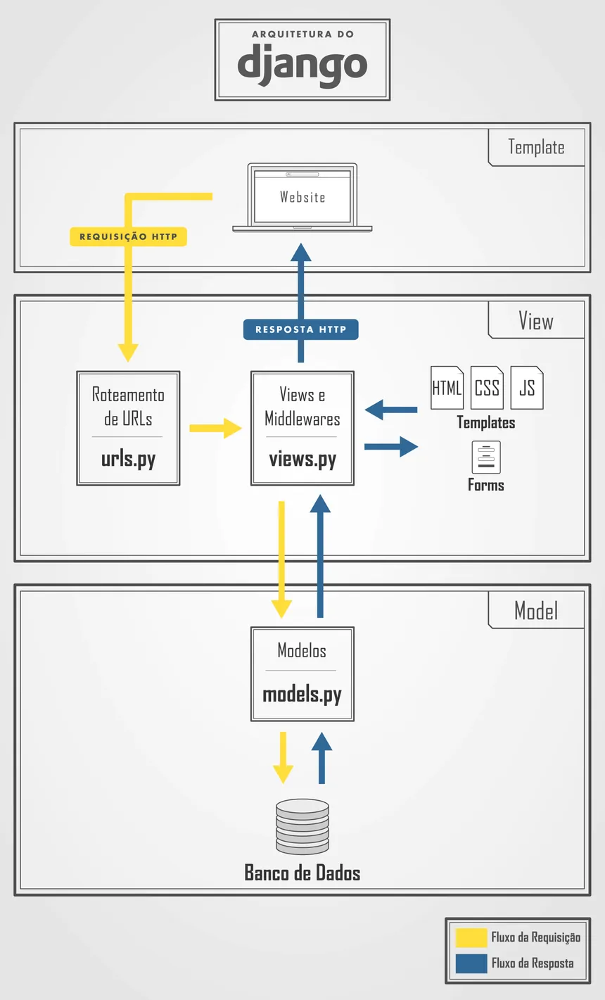

# Projeto Arquitetural do Software

Documento construído a partido do **Modelo BSI - Doc 005 - Documento de Projeto Arquitetual do Software** que pode ser encontrado no
link:https://docs.google.com/document/d/1i80vPaInPi5lSpI7rk4QExnO86iEmrsHBfmYRy6RDSM/edit?usp=sharing

## Visão Geral da Arquitetura

Imagem com a organização geral dos componentes da arquitetura do projeto.

## Descrição da Arquitetura do Projeto

A arquitetura de um projeto Django é geralmente referida como uma arquitetura **MTV (Model, Template, View)**. Aqui está uma descrição detalhada de cada componente:

1. **Model**: É responsável pelo mapeamento do banco de dados para o projeto. É onde o Django fornece sua ORM (Object-Relational Mapping) para a modelagem de dados.

2. **Template**: São as páginas para visualização de dados. Normalmente, é aqui que fica o HTML que será renderizado nos navegadores.

3. **View**: É onde a lógica de negócio é implementada. É aqui que determinamos o que irá acontecer em nosso projeto.

Esses três componentes são interligados e se comunicam entre si. Uma depende da outra para realizar um determinado serviço e, no final, executar a tarefa que o usuário solicitou.

Quando o usuário faz uma requisição pelo navegador, utilizando uma rota, é executado um método das Views, que utiliza os Models para acessar o banco de dados e retornar as informações. Estas informações são renderizadas pela camada de Template e, finalmente, é renderizado para o usuário pelo navegador.

A arquitetura MTV do Django é semelhante ao padrão MVC (Model, View, Controller), utilizado em diversos outros frameworks. As camadas do padrão MTV podem ser comparadas ao MVC da seguinte maneira:

- M (MTV) = M (MVC): Ambas as camadas possuem a mesma responsabilidade, que é o mapeamento do banco de dados para o projeto.
- T (MTV) = V (MVC): Ambas as camadas possuem a mesma responsabilidade, que é exibir informações para o usuário da aplicação, normalmente utilizando páginas HTML.
- V (MTV) = C (MVC): Apesar de possuírem responsabilidades parecidas, conceitualmente, apresentam algumas diferenças.

Em uma arquitetura monolítica, todas as funcionalidades da aplicação são desenvolvidas em apenas um projeto, causando uma alta dependência no código implementado, fazendo comunicação entre as funcionalidades a nível de classe.

