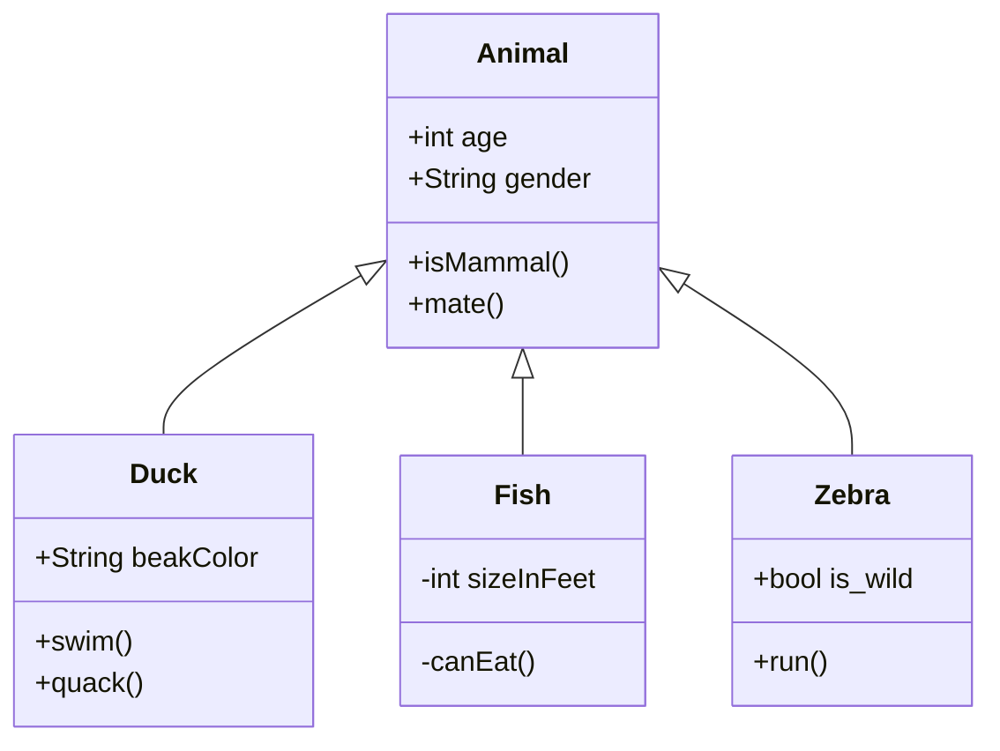
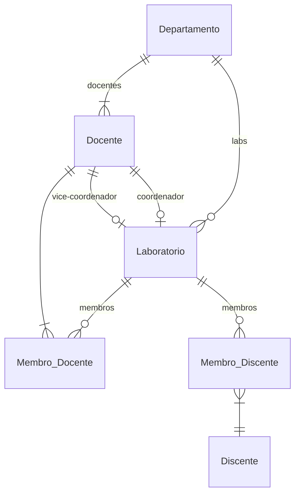

# Documento de Modelos

Neste documento temos o modelo Conceitual (UML) ou de Dados (Entidade-Relacionamento). Temos também a descrição das entidades e o dicionário de dados.

Para a modelagem pode se usar o Astah UML ou o BrModelo. Uma ferramenta interessante para modelos UML é a [YUML](http://yuml.me), no link temos um exemplo de [Modelo UML com YUML](yuml/monitoria-yuml.md). Atualmente é possível usar a ferramenta **Mermaid** segundo o blog do GitHub [Include diagrams in your Markdown files with Mermaid](https://github.blog/2022-02-14-include-diagrams-markdown-files-mermaid/). A documentação do **Mermaid** pode ser encontrada em [Mermaid in GitHub](https://mermaid-js.github.io/mermaid).

## Modelo Conceitual

### Diagrama de Classes usando Mermaid

### Descrição das Entidades

Descrição sucinta das entidades presentes no sistema.

| Entidade | Descrição   |
|----------|------------------------------------------------------------------------------------------------------------------------------------------------------|
| Animal   | Entidade abstrata para representar informações gerais dos Animais: age, gender, isMammal(), mate().                                                  |
| Duck     | Entidade que representa um Pato tem as informações: String beakColor, +swim(), +quack(). A classe Duck estende a classe abstrata Animal. |
| Fish     | Entidade que representa um Peixe tem as informações: sizeInFeet, -canEat(). A classe Peixe estende a classe abstrata Animal.                                                                   |
| Zebra    | Entidade que representa um Zebra tem as informações is_wild, run(). A classe Zebra estende a classe abstrata Animal.                                                                   |

## Modelo de Dados (Entidade-Relacionamento)

Para criar modelos ER é possível usar o BrModelo e gerar uma imagem. Contudo, atualmente é possível criar modelos ER usando a ferramenta **Mermaid**, escrevendo o modelo diretamente em markdown. Acesse a documentação para escrever modelos [ER Diagram Mermaid](https://mermaid-js.github.io/mermaid/#/entityRelationshipDiagram).

### Dicionário de Dados

|   Tabela   | Cliente |
| ---------- | ----------- |
| Descrição  | Armazena as informações dos clientes da assistência tecnica de celulares. |

|  Nome         | Descrição                        | Tipo de Dado | Tamanho | Restrições de Domínio |
| ------------- | -------------------------------- | ------------ | ------- | --------------------- |
| id_cliente    | Número de idenficação do cliente | SERIAL       | ---     | PK / Identity |
| nome          | Nome do cliente                  | VARCHAR      | 150     | Not Null |
| email         | Endereço de e-mail do cliente    | VARCHAR      | 150     | Not Null |
| fone          | Número de telefone do cliente    | VARCHAR      | 150     | Not Null |
| cpf           | Número de CPF do cliente         | VARCHAR      | 250     | Not Null |

|   Tabela   | Aparelho |
| ---------- | ----------- |
| Descrição  | Armazena as informações dos aparelhos da assistência tecnica de celulares. |

|  Nome         | Descrição                        | Tipo de Dado | Tamanho | Restrições de Domínio |
| ------------- | -------------------------------- | ------------ | ------- | --------------------- |
| IMEI          | IMEI do aparelho                 | SERIAL       | ---     | PK / Identity |
| num_serie     | Número de série do aparelho      | VARCHAR      | 150     | Not Null |
| marca         | Marca do aparelho                | VARCHAR      | 150     | Not Null |
| modelo        | Modelo do aparelho               | VARCHAR      | 150     | Not Null |
| descricao     | Descrição problema pelo cliente  | VARCHAR      | 250     | Not Null |

|   Tabela   | Pedido |
| ---------- | ----------- |
| Descrição  | Armazena as informações dos pedidos da assistência tecnica de celulares. |

|  Nome         | Descrição                        | Tipo de Dado | Tamanho | Restrições de Domínio |
| ------------- | -------------------------------- | ------------ | ------- | --------------------- |
| id_pedido     | Identificador do pedido          | SERIAL       | ---     | PK / Identity |
| status        | Estado do pedido (ativo/inativo) | BOOLEAN      | 150     | Not Null |
| data          | Data do pedido                   | VARCHAR      | 150     | Not Null |
| problema      | Descrição do problema tecnico    | VARCHAR      | 150     | Not Null |
| cpf_cliente   | CPF cliente associado ao pedido  | VARCHAR      | 250     | FK / Not Null |

|   Tabela   | Pagamento |
| ---------- | ----------- |
| Descrição  | Armazena as informações dos pagamentos da assistência tecnica de celulares. |

|  Nome         | Descrição                        | Tipo de Dado | Tamanho | Restrições de Domínio |
| ------------- | -------------------------------- | ------------ | ------- | --------------------- |
| id_pagamento  | Identificador de pagamento       | SERIAL       | ---     | PK / Identity         |
| modo_pagamento| Modo de pagamento                | BOOLEAN      | 150     | Not Null              |
| valor_pagament| Valor do pagamento               | VARCHAR      | 150     | Not Null              |
| cpf_cliente   | CPF cliente associado ao pedido  | VARCHAR      | 250     | FK / Not Null         |

|   Tabela   | Relatório |
| ---------- | ----------- |
| Descrição  | Armazena as informações da assistência tecnica de celulares. |

|  Nome         | Descrição                        | Tipo de Dado | Tamanho | Restrições de Domínio |
| ------------- | -------------------------------- | ------------ | ------- | --------------------- |
| nome_relatorio| Identificador de pagamento       | VARCHAR      | ---     | Not Null              |
