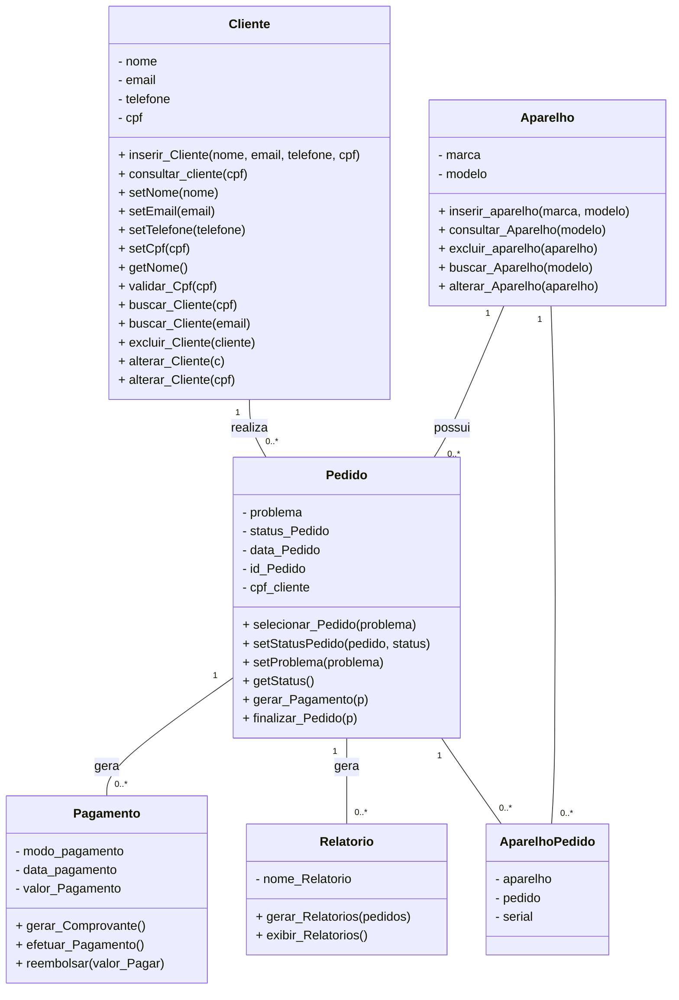

# Documento de Visão

Documento construído a partido do **Modelo BSI - Doc 001 - Documento de Visão** que pode ser encontrado no
link: https://docs.google.com/document/d/1x3nvXfGH9MjGi0jumPmdyokC6Dfg0QCK/edit?usp=sharing&ouid=113399813679649873304&rtpof=true&sd=true

## Equipe e Definição de Papéis

Membros          |     Papel     |   E-mail   |
---------------- | ------------- | ---------- |
Fábio Fabricio   | Desenvolvedor | fabio.araujo.016@edu.ufrn.br
Flávio Glaydson  | Tech Leader   | flavio.lopes.709@edu.ufrn.br
Gabriel José     | Analista      | gabriel.aquino069@edu.ufrn.br
Laian Kevin      | Desenvolvedor | kevin.silva.701@ufrn.edu.br
Samuel Gutemberg | Testador      | samuel.gutemberg.069@ufrn.edu.br

### Matriz de Competências

Membro           |     Competências   |
---------------- | ------------------ |
Fábio Fabricio   | Python, Javascript e Web Design                  
Flávio Glaydson  | Metodologias Ágeis, C, Python, Flutter, Javascript, UML                   
Gabriel José     | C, Python, Javascript e Node.Js 
Laian Kevin      | C, Python e JavaScript                   
Samuel Gutemberg | C, Python, Javascript e UML                   

## Perfis dos Usuários

O sistema poderá ser utilizado por diversos usuários. Temos os seguintes perfis/atores:

Perfil                                 | Descrição   |
-------------------------------------- | ----------- |
Cliente | Este usuário é responsável por fornecer informações pessoais e sobre o produto com defeito que serão utilizadas na alimentação do sistema e na solicitação do serviço de assistência técnica.
Técnico | Este usuário é capacitado na área e responsável pelo serviço de assistência técnica. 

## Lista de Requisitos Funcionais

Requisito                                 | Descrição   | Ator |
---------                                 | ----------- | ---------- |
RF001 - Cadastrar Cliente |  Cliente tem os atributos nome, email, cpf, telefone e endereço. | Técnico |
RF002 - Alterar Cliente | A alteração permite a mudança do nome, email, telefone e endereço. | Técnico |
RF003 - Excluir Cliente | O sistema deve permitir a exclusão de informações cadastradas.| Técnico |
RF004 - Listar Cliente | Deve permitir a listagem de todos os clientes.  | Técnico |
RF005 - Visualizar Cliente |  Deve permitir a visualização das informações de um cliente em específico | Técnico |
RF006 - Cadastrar Aparelho | Aparelho tem os atributos marca, modelo, IMEI, número de série, descrição do problema e CPF do proprietário.| Técnico |
RF007 - Alterar Aparelho | A alteração permite a mudança da marca, modelo, IMEI, número de série. | Técnico | 
RF008 - Listar Aparelho |  Deve permitir a listagem de todos os aparelhos. | Técnico |
RF009 - Visualizar Aparelho | Deve permitir a visualização das informações de um Aparelho em específico. | Técnico |
RF010 - Analisar Pedido | O pedido deve ser analisado com base na legislação prevista no CDC. | Técnico |
RF011 - Cadastrar Descrição | Inclui descrição do problema | Técnico |
RF012 - Gerar Protocolo | Após a análise do pedido o sistema gerará um número de protocolo. | Técnico |
RF013 - Calcular Prazo | Será calculado um prazo de serviço | Técnico |
RF014 - Pagar | O sistema disponibilizará de opções de pagamento, via pix, cartão, boleto ou em espécie.| Técnico e Cliente |
RF015 - Gerar comprovante de pagamento | |Técnico|
RF016 - Gerar Relatórios |Gerar e exibir relatórios os quais podem ser listados por Marca, Cliente, Problemas solucionados.|Técnico|

### Modelo Conceitual

## Lista de Requisitos Não-Funcionais

Requisito                                 | Descrição   |
---------                                 | ----------- |
RNF001 - Deve ser acessível via navegador | Deve abrir perfeitamento no Firefox e no Chrome. |
RNF002 - Consultas deve ser eficiente | O sistema deve executar as consultas em milessegundos |
RNF003 - Log e histórico de acesso e funções | Deve manter um log de todos os acessos e das funções executadas pelo usuário |
RNF006 - Portabilidade | O sistema será voltado para todos os dispositivos que têm acesso a internet e ao navegador.|
RNF007 - Treinamento | Os usuários deverão passar por um pequeno tutorial antes de usar o programa efetivamente. |
RNF008 - Segurança de dados | Os dados serão protegidos com criptografia de ponta-a-ponta. |
RNF009 - Entrega |Entregar o relatório com a lista de pedidos de assistência da semana na segunda e outro relatório com os serviços concluídos no sábado |
RNF010 - Limite de pedidos semanais | O usuário terá um limite de 20 pedidos(por técnico) de análise por semana |
RNF011 - Limite no tamanho do arquivo contendo o comprovante de pagamento | O arquivo enviado pelo cliente que solicitou o serviço deve possuir no máximo 10 Mb |
RNF012 - O pagamento deverá ser efetuado após a prestação do serviço. | 

## Riscos

Tabela com o mapeamento dos riscos do projeto, as possíveis soluções e os responsáveis.

Data | Risco | Prioridade | Responsável | Status | Providência/Solução |
------ | ------ | ------ | ------ | ------ | ------ |
09/03/2024 | Não aprendizado das ferramentas utilizadas pelos componentes do grupo | Alta | Gerente | Vigente | Reforçar estudos sobre as ferramentas e aulas com a integrante que conhece a ferramenta |
09/03/2024 | Ausência por qualquer motivo do cliente | Média | Gerente | Vigente | Planejar o cronograma tendo em base a agenda do cliente |
09/03/2024 | Divisão de tarefas mal sucedida | Baixa | Gerente | Vigente | Acompanhar de perto o desenvolvimento de cada membro da equipe |
09/03/2024 | Implementação de protótipo com as tecnologias | Alto | Todos | Vigente | Encontrar tutorial com a maioria da tecnologia e implementar um caso base do sistema. |
09/03/2024 | Não conseguir implementar os métodos de pagamento | Alto | Desenvolvedor | Vigente | Pedir ajuda a um meio externo (outra pessoa) |
09/03/2024 | Não garantir a segurança do sistema | Alto | Testador | Vigente | Realizar teste com foco em segurança |

### Referências
Relatório Técnico, elaborado na disciplina de Organização, Sistemas e Métodos pelos alunos Guilherme Angelo de Medeiros, Renan Vale Dantas e Samuel Gutemberg Pereira no ano de 2021, sobre a documentação de um projeto de software - Gestão de uma assistência técnica de celulares.
